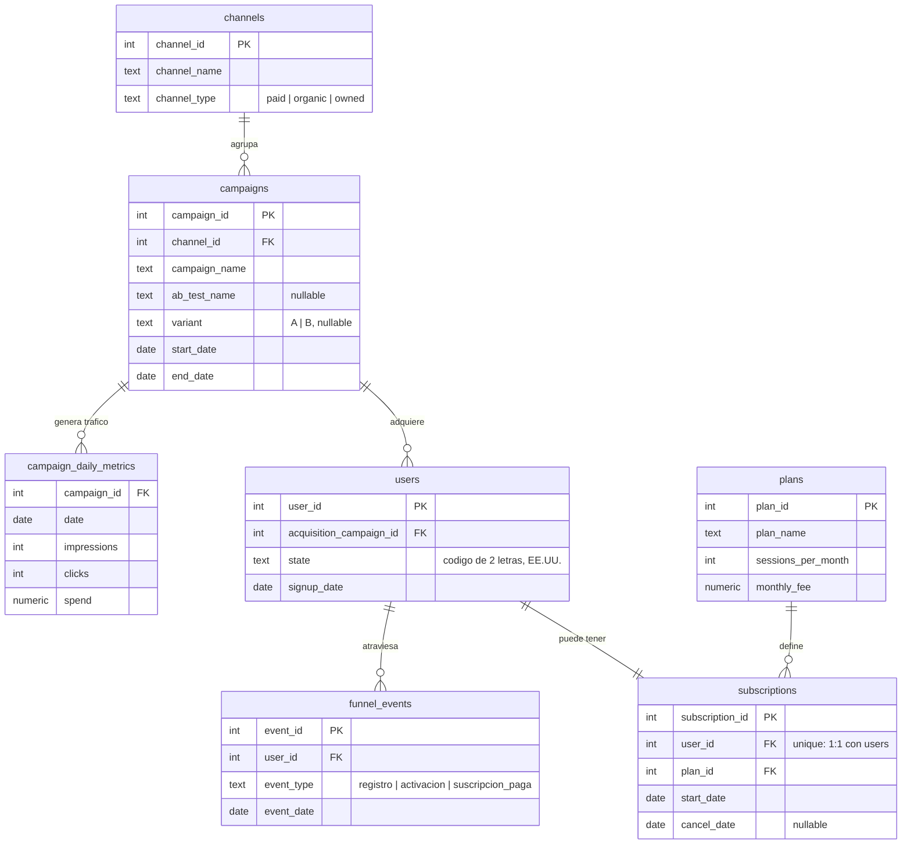

# light-it-analytics

Simulación end-to-end de growth analytics para una plataforma de teleterapia
en EE.UU. (una sociedad de psicólogos que atiende pacientes por videollamada).
Genera datos sintéticos pero realistas de marketing, funnel de conversión y
suscripciones, calcula las métricas de negocio estándar (CAC, ARPU, churn,
LTV) y evalúa un test A/B con significancia estadística — todo persistido en
SQLite, listo para conectarse a Power BI (o cualquier BI tool) sin tener que
reimplementar la lógica de negocio en DAX.

Es un proyecto de portfolio: el objetivo es mostrar cómo diseñaría el modelo
de datos, el pipeline y las métricas de un caso de growth/marketing analytics
real, de punta a punta.

## Qué preguntas responde

- **¿Qué canal de adquisición es más eficiente?** CAC, ARPU, churn mensual y
  LTV por canal, con el ratio LTV:CAC como métrica resumen.
- **¿Dónde se pierden los usuarios en el funnel?** Conversión etapa a etapa
  (registro → activación → suscripción paga) por canal.
- **¿La audiencia lookalike de Meta convierte mejor que la broad?** Test A/B
  con test de proporciones (z-test) y p-value.
- **¿Cómo evoluciona el costo de adquisición en el tiempo?** Costo por
  registro, mes a mes, por canal.

## Stack

| Capa | Herramienta |
|---|---|
| Generación de datos sintéticos | Python 3.12, `numpy` |
| Estadística (test A/B) | `scipy.stats` |
| Almacenamiento | SQLite |
| Métricas de negocio | SQL + Python (persistidas como tablas "mart") |
| Consumo final | Power BI (o cualquier herramienta que lea SQLite/ODBC) |

## Modelo de datos



`channel_metrics` y `ab_test_results` son tablas adicionales, generadas por
`analysis.py`, que guardan los resultados ya calculados (no forman parte del
esquema transaccional).

## Cómo correrlo

```bash
pip install -r python/requirements.txt
python python/generate_data.py
python python/analysis.py
```

El primer script recrea `data/teleterapia.db` desde cero (aplica
`sql/schema.sql` y simula todo el pipeline con una seed fija para que el
resultado sea reproducible). El segundo calcula las métricas y las persiste
como tablas `channel_metrics` y `ab_test_results` en esa misma base.

Para explorar los datos a mano, `sql/metrics_queries.sql` tiene queries de
referencia (costo por registro mensual, CAC blended, conversión de funnel)
pensadas para el equipo de growth.

## Estructura del repo

```
sql/
  schema.sql            esquema transaccional (dimensiones + hechos)
  metrics_queries.sql   queries de referencia para growth
python/
  config.py             parámetros de negocio (canales, tasas, precios, A/B test)
  generate_data.py       genera la simulación completa en SQLite
  analysis.py            calcula CAC/ARPU/churn/LTV y el test A/B, los persiste
  requirements.txt
data/
  teleterapia.db          base generada (no se versiona, se regenera con los scripts)
```

## Resultados de ejemplo

Con la seed por defecto (`RANDOM_SEED = 42` en `config.py`):

**Métricas por canal** (`channel_metrics`)

| Canal | Gasto | Registros | Clientes pagos | CAC | ARPU mensual | Churn mensual | LTV | LTV:CAC |
|---|---|---|---|---|---|---|---|---|
| email | $1,050 | 268 | 113 | $9.30 | $209.82 | 2.2% | $9,591.91 | 1031.4 |
| organic | $0 | 386 | 140 | — | $215.00 | 3.6% | $6,061.35 | — |
| google_ads | $78,291 | 1,235 | 357 | $219.30 | $206.08 | 5.1% | $4,077.93 | 18.6 |
| meta | $38,573 | 982 | 141 | $273.57 | $208.09 | 5.2% | $3,968.48 | 14.5 |

Email y orgánico son, por lejos, los canales más eficientes (costo marginal
bajo o nulo y menor churn); los canales pagos masivos (Google/Meta) traen
mucho más volumen pero a un CAC ~20-30x mayor.

**Test A/B** (`meta_targeting_test`, audiencia broad vs. lookalike)

| Variante | Clicks | Registros | Tasa conversión | z | p-value | Significativo (95%) |
|---|---|---|---|---|---|---|
| A (broad) | 1,243 | 40 | 3.22% | -1.726 | 0.0843 | No |
| B (lookalike) | 1,228 | 56 | 4.56% | -1.726 | 0.0843 | No |

La variante lookalike convierte ~42% mejor en la muestra, pero con este
volumen de clicks el resultado **no llega a ser estadísticamente
significativo al 95%** (p = 0.084) — un ejemplo real de por qué conviene
calcular significancia antes de declarar un ganador en un test A/B.

## Decisiones de diseño

- **Seed fija (`RANDOM_SEED = 42`)**: todo el pipeline es reproducible; correr
  `generate_data.py` dos veces da exactamente la misma base.
- **Las tasas de negocio (`config.py`) no se usan en `analysis.py`**: las
  métricas se *estiman* desde los datos generados (igual que haría un
  analista real, que nunca tiene acceso a las probabilidades "verdaderas" de
  generación), no se leen de la configuración.
- **Churn estimado por método persona-periodo**: cada suscripción aporta N
  periodos de 30 días en riesgo, y 1 evento si terminó en cancelación (las
  suscripciones activas quedan censuradas, no se cuentan como churn).
- **CAC calculado con CTEs separados por grano** (`sql/metrics_queries.sql`,
  query 2): unir gasto diario y clientes pagos en un solo JOIN generaría
  fan-out e infla el gasto total; se agregan por separado antes de unir.
- **15 estados de EE.UU. en vez de 50**: los de mayor población, para no
  diluir el volumen de datos en estados con muestras demasiado chicas para
  ser informativas.

## Roadmap

- [ ] Dashboard en Power BI conectado a `data/teleterapia.db` (modelo,
      medidas DAX y visualizaciones sobre `channel_metrics` y
      `ab_test_results`).
- [ ] Cohortes de retención por mes de alta.
- [ ] Forecast simple de MRR a partir del churn observado.
