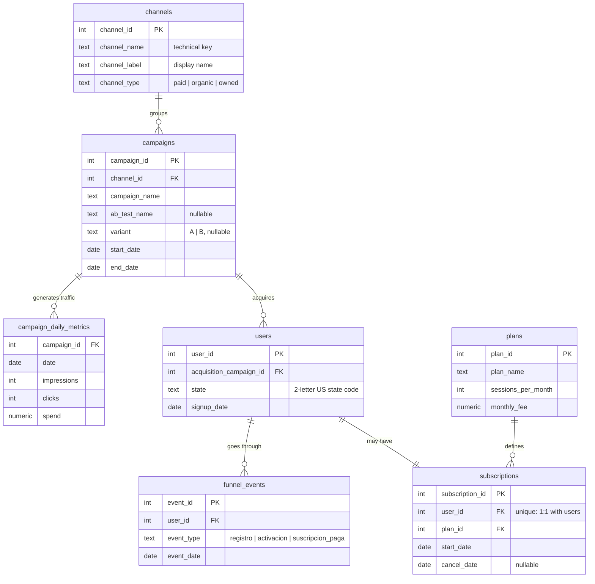

# growth-analytics-simulation

End-to-end growth analytics simulation for a US teletherapy platform (a
group of licensed psychologists treating patients over video calls). It
generates synthetic but realistic marketing, funnel and subscription data,
computes the standard business metrics (CAC, ARPU, churn, LTV), evaluates an
A/B test with proper statistics and breaks acquisition performance down by
US state — all persisted in SQLite and served to a Power BI dashboard built
as code.

I built this as a portfolio project to practice and show how I approach a
growth/marketing analytics case from start to finish: data model design,
dataset generation, metric computation, A/B test evaluation with real
statistics (not just "which number is bigger") and a dashboard that ends with
a business recommendation.

## Dashboard

**[Open the live dashboard](https://app.powerbi.com/view?r=eyJrIjoiNzVmMjhlOTQtNzEzZS00OThmLTkxNjgtZDdkMWY3YjE4YzNiIiwidCI6ImY5MGE4NjRlLTM2ZjQtNGY5Zi1iNmE2LWU1ZDJjOGU3ZTVjYiIsImMiOjR9)** —
interactive, no login required (Power BI publish-to-web).

Five pages, one question each, every page closing with a written takeaway.
A channel filter in the sidebar drives every visual through the `channels`
dimension.


| | |
|---|---|
|  |  |
|  |  |

## Questions it answers

- Which acquisition channel is most efficient (CAC, ARPU, monthly churn and
  LTV by channel, with LTV:CAC as the summary ratio).
- Where users drop off in the funnel (stage-to-stage conversion: signup →
  activation → paid subscription, by channel).
- Whether Meta's lookalike audience converts better than the broad one (A/B
  test with a two-proportion z-test and p-value).
- How acquisition cost evolves month by month, by channel.
- In which US states each channel works and where budget should move
  (conversion and estimated CAC by state × channel).

## Stack

| Layer | Tool |
|---|---|
| Synthetic data generation | Python 3.12, `numpy` |
| Statistics (A/B test) | `scipy.stats` |
| Storage | SQLite |
| Business metrics | SQL + Python (persisted as mart tables) |
| Dashboard | Power BI, saved as a `.pbip` project (report as code) |

## Data model



On top of the transactional schema, `analysis.py` writes the mart tables
the dashboard reads: `channel_metrics`, `monthly_channel_metrics`,
`funnel_conversion`, `state_metrics`, `state_channel_metrics`,
`ab_test_results`, `ab_test_summary` and `ab_test_daily`.

## How to run it

```bash
pip install -r python/requirements.txt
python python/generate_data.py
python python/analysis.py
python python/export_for_powerbi.py
pytest python/tests
```

`generate_data.py` rebuilds `data/teleterapia.db` from scratch (applies
`sql/schema.sql` and simulates the whole pipeline with a fixed seed, so the
result is reproducible). `analysis.py` computes the metrics and persists them
as mart tables in the same database. `export_for_powerbi.py` dumps those
tables plus the `channels` dimension to `data/powerbi/*.csv`, which is what
the Power BI model reads — no SQLite ODBC driver needed. The tests check the
pipeline's invariants (rates within 0–1, totals consistent across mart
tables, exactly two A/B variants).

`sql/metrics_queries.sql` has reference queries (monthly cost per signup,
blended CAC, funnel conversion) written for a growth team.

### Opening the dashboard

`powerbi/growth_analytics_dashboard.pbip` is a Power BI **project**, not a
`.pbix`. To open it, Power BI Desktop needs the preview feature *Power BI
Project (.pbip) save option* enabled (File → Options → Preview features), then
File → Open the `.pbip`. The Power Query sources point to the absolute path
of `data/powerbi/` on the machine where the project was saved; after cloning,
repoint them once in Transform data → Data source settings.

## Repository layout

```
sql/
  schema.sql              transactional schema (dimensions + facts)
  metrics_queries.sql     reference queries for the growth team
python/
  config.py               business parameters (channels, rates, prices, A/B test, state effects)
  generate_data.py        generates the full simulation into SQLite
  analysis.py             computes CAC/ARPU/churn/LTV, funnel, geography and the A/B test
  export_for_powerbi.py   exports the mart tables to CSV for Power BI
  tests/                  pipeline invariants (pytest)
data/
  teleterapia.db          generated database (not versioned, rebuilt by the scripts)
  powerbi/                CSV mart tables, the dashboard's source
docs/
  screenshots/            one capture per dashboard page
powerbi/
  growth_analytics_dashboard.pbip           Power BI project (open this)
  growth_analytics_dashboard.Report/        pages and visuals as JSON (PBIR)
  growth_analytics_dashboard.SemanticModel/ tables, relationships, measures (TMDL)
  theme.json                                report theme (palette, typography, cards)
```

Comments and identifiers in the Python/SQL code are in Spanish; everything
user-facing (dashboard, this README) is in English.

## Sample results

With the default seed (`RANDOM_SEED = 42` in `config.py`):

**Metrics by channel** (`channel_metrics`)

| Channel | Spend | Signups | Paying customers | CAC | Monthly ARPU | Monthly churn | LTV | LTV:CAC |
|---|---|---|---|---|---|---|---|---|
| Email | $1,050 | 268 | 137 | $7.67 | $213.58 | 2.7% | $8,019.80 | 1045.6 |
| Organic | $0 | 386 | 134 | — | $215.97 | 3.3% | $6,469.71 | — |
| Google Ads | $78,291 | 1,235 | 414 | $189.11 | $211.55 | 4.3% | $4,965.25 | 26.3 |
| Meta | $38,573 | 982 | 132 | $292.22 | $215.98 | 7.3% | $2,962.08 | 10.1 |

Email and organic are by far the most efficient channels (near-zero marginal
cost and the lowest churn); the paid channels bring far more volume but at a
25–40x higher CAC, and Meta also retains worse. The blended CAC across all
channels is $144.

**Funnel by channel** (`funnel_conversion`)

| Channel | Signups | Activations | Paid | Signup → activation | Activation → paid | Signup → paid |
|---|---|---|---|---|---|---|
| Email | 268 | 228 | 137 | 85.1% | 60.1% | 51.1% |
| Organic | 386 | 277 | 134 | 71.8% | 48.4% | 34.7% |
| Google Ads | 1,235 | 892 | 414 | 72.2% | 46.4% | 33.5% |
| Meta | 982 | 498 | 132 | 50.7% | 26.5% | 13.4% |

**State × channel** (`state_channel_metrics`, excerpt)

| State | Channel | Signups | Paid | Signup → paid | Estimated CAC |
|---|---|---|---|---|---|
| TX | Google Ads | 211 | 98 | 46.4% | $136 |
| TX | Meta | 138 | 10 | 7.2% | $537 |
| FL | Meta | 105 | 8 | 7.6% | $516 |
| NY | Email | 26 | 22 | 84.6% | $5 |
| CA | Meta | 194 | 36 | 18.6% | $213 |

Meta's problem is not uniform: in Texas and Florida it converts at less than
half its California rate, with an estimated CAC above $500. The
recommendation that comes out of the dashboard is to move Meta budget in
TX/FL to Google Ads (the most efficient paid channel in Texas) and to double
down on email in the Northeast. Spend by state is *estimated*: ad platforms
report it per campaign, so each campaign's spend is allocated to states in
proportion to the signups it produced there.

**A/B test** (`meta_targeting_test`, broad vs. lookalike audience)

| Variant | Clicks | Signups | Conversion rate | z | p-value | Significant (95%) |
|---|---|---|---|---|---|---|
| A (broad) | 1,243 | 40 | 3.22% | -1.726 | 0.0843 | No |
| B (lookalike) | 1,228 | 56 | 4.56% | -1.726 | 0.0843 | No |

The lookalike variant converts ~42% better in the sample, but with this
click volume the result does not reach statistical significance at 95%
(p = 0.084): the 95% confidence interval of the difference runs from −0.2 to
+2.9 percentage points and still includes zero. A textbook case of "one
variant looks like a winner, but the sample is not large enough to say so".
`ab_test_summary` turns that into a decision: confirming a lift of this size
with 80% power would take ~3,300 clicks per variant (2.6x the sample), about
80 more days at the test's daily budget — so the recommendation is to keep
the test running rather than declare B the winner. `ab_test_daily` holds the
cumulative conversion by variant, day by day, for the monitoring chart.

## Design decisions

- **Fixed seed (`RANDOM_SEED = 42`)**: the whole pipeline is reproducible;
  running `generate_data.py` twice produces exactly the same database.
- **The business rates in `config.py` are never read by `analysis.py`**: the
  metrics are estimated from the generated data, the way a real analyst
  would (they never see the "true" generating probabilities).
- **The effects the analysis "discovers" are planted in the simulation**: the
  difference between A/B variants and the conversion multipliers by state and
  channel. Without them, any geographic difference would be noise, and a
  dashboard that finds patterns that do not exist is worse than one without
  that page.
- **Churn estimated with the person-period method**: every subscription
  contributes N 30-day periods at risk, plus 1 event if it ended in a
  cancellation (active subscriptions are censored, not counted as churn).
- **CAC computed with separate CTEs per grain** (`sql/metrics_queries.sql`,
  query 2): joining daily spend and paying customers in a single JOIN would
  fan out and inflate total spend; they are aggregated separately first.
- **15 US states instead of 50**: the most populous ones, so that per-state
  samples stay large enough to be informative.
- **Dashboard as code**: the report is stored as a `.pbip` project (PBIR JSON
  + TMDL), so every page, visual and relationship is versioned and reviewable
  in a diff. Business names live in the semantic layer (renamed columns and
  DAX measures such as `Blended CAC`), never in the source data.
- **Blended CAC is a measure, not an average of ratios**: total spend divided
  by total paying customers, so it stays correct under any channel filter.

## Roadmap

- [x] Power BI dashboard (overview, funnel, monthly trend, geography, A/B test).
- [x] Publish to web (public interactive link).
- [ ] Retention cohorts by signup month.
- [ ] Simple MRR forecast from observed churn.

## License

MIT — see [LICENSE](LICENSE).
