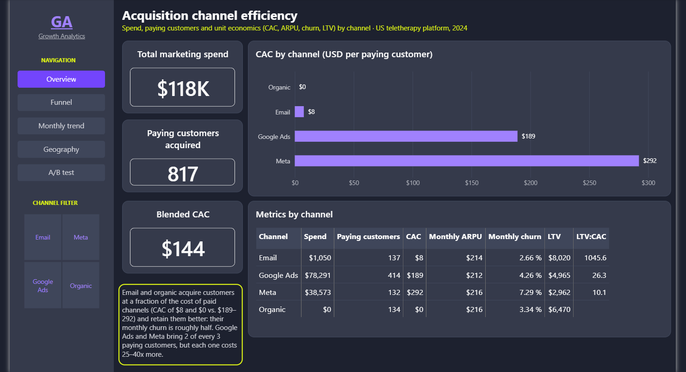
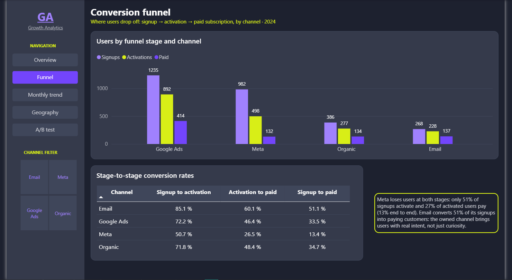
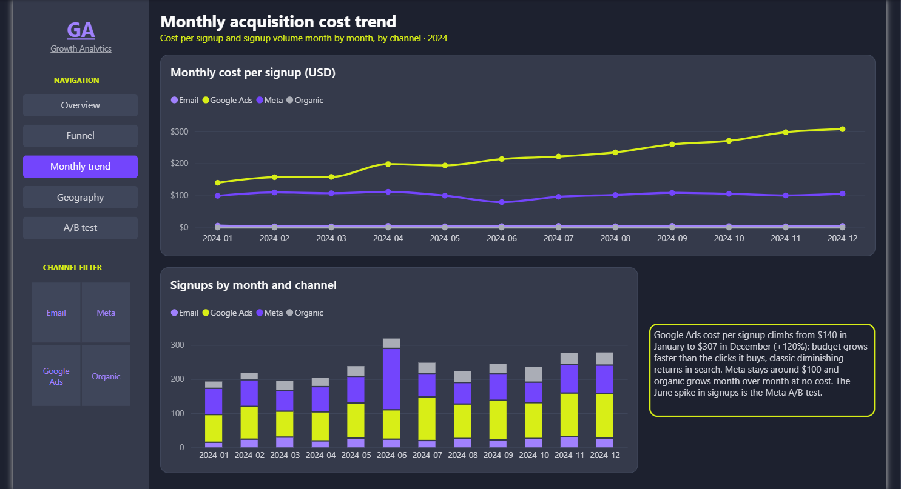
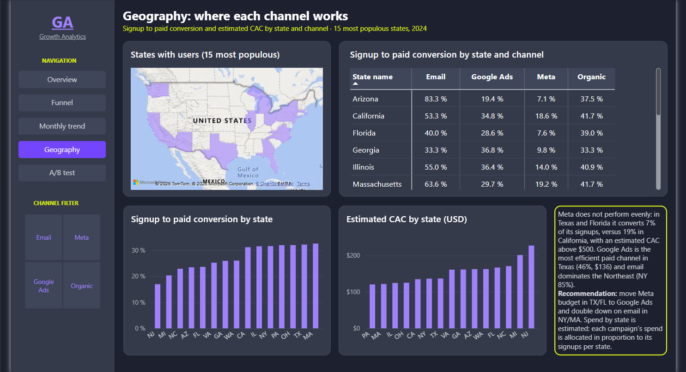
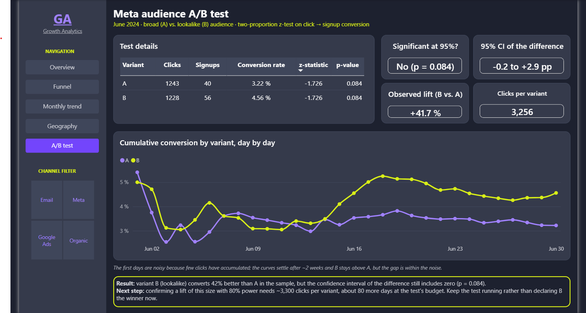

# Growth Analytics Simulation

A portfolio project that answers one question a growth team asks every
quarter: **where should the next marketing dollar go?**

I built a realistic, simulated year of data for a US teletherapy platform
(a group of licensed psychologists treating patients over video calls) —
four acquisition channels, a signup → activation → paid funnel,
subscriptions with churn, an A/B test and a geographic breakdown — and a
Power BI dashboard that turns it into decisions.

## Dashboard

**[Open the live dashboard](https://app.powerbi.com/view?r=eyJrIjoiNzVmMjhlOTQtNzEzZS00OThmLTkxNjgtZDdkMWY3YjE4YzNiIiwidCI6ImY5MGE4NjRlLTM2ZjQtNGY5Zi1iNmE2LWU1ZDJjOGU3ZTVjYiIsImMiOjR9)** —
interactive, no login required.

Five pages, one question each, every page closing with a written takeaway.
A channel filter in the sidebar drives every visual.



| | |
|---|---|
|  |  |
|  |  |

## What I set out to answer

- Which acquisition channel is actually the most efficient once you look
  past volume — cost per paying customer (CAC), what a customer is worth
  over time (LTV) and how fast they churn.
- Where users drop off between signing up and paying, and whether that
  differs by channel.
- How acquisition cost evolves month by month — are we paying more for the
  same result?
- Whether the channels perform the same everywhere in the US, or whether the
  budget should move between states.
- Whether an A/B test on Meta audiences has a real winner, or just a lucky
  sample.

## Key findings

1. **Email and organic are the efficient channels; paid channels buy
   volume.** Email acquires a paying customer for $8 and organic for $0,
   against $189 (Google Ads) and $292 (Meta). Google Ads and Meta still bring
   2 of every 3 paying customers, so they cannot simply be cut — but every
   one of those customers costs 25–40x more, and Meta's churn is the highest.
2. **Meta's problem is the funnel, not the traffic.** Only half of Meta
   signups ever activate and a quarter of those pay: 13% end to end, versus
   51% for email. Meta brings curiosity; email brings intent.
3. **Google Ads is getting more expensive every month.** Cost per signup
   climbed from $140 in January to $307 in December (+120%) while budget
   grew — a textbook case of diminishing returns in search.
4. **The Meta problem is regional.** In Texas and Florida Meta converts 7% of
   signups at an estimated CAC above $500; in California it converts 19%.
   The recommendation: move Meta budget in TX/FL to Google Ads (46%
   conversion in Texas) and double down on email in the Northeast.
5. **The A/B test has no winner yet.** The lookalike audience looks 42%
   better, but the confidence interval of the difference still includes
   zero (p = 0.084). Confirming a lift of that size would need ~3,300
   clicks per variant — about 80 more days at the test's budget — so the
   right call is to keep it running, not to declare a winner.

## How I built it

I designed this project end to end: the business scenario, the acquisition
channels and their economics, the metrics that matter (CAC, LTV, churn,
funnel conversion), the effects planted in the simulation so the analysis
has something real to find, and the dashboard — what each page answers, how
it reads, and what recommendation it lands on. I used AI (Claude) as a
coding assistant to implement the Python/SQL pipeline and the Power BI
plumbing under my direction, reviewing and questioning each step.

## Tech at a glance

| | |
|---|---|
| Data generation & metrics | Python (`numpy`, `scipy`), SQL, SQLite |
| Statistics | Two-proportion z-test, confidence intervals, required sample size |
| Dashboard | Power BI, stored as a `.pbip` project (report as code) |
| Design | Dark theme inspired by Light-it's brand palette |

## Run it

```bash
pip install -r python/requirements.txt
python python/generate_data.py
python python/analysis.py
python python/export_for_powerbi.py
```

The whole pipeline is reproducible from a fixed seed. Details on the data
model, the mart tables, design decisions and how to open the Power BI
project are in [docs/technical-notes.md](docs/technical-notes.md).

## License

MIT — see [LICENSE](LICENSE).
