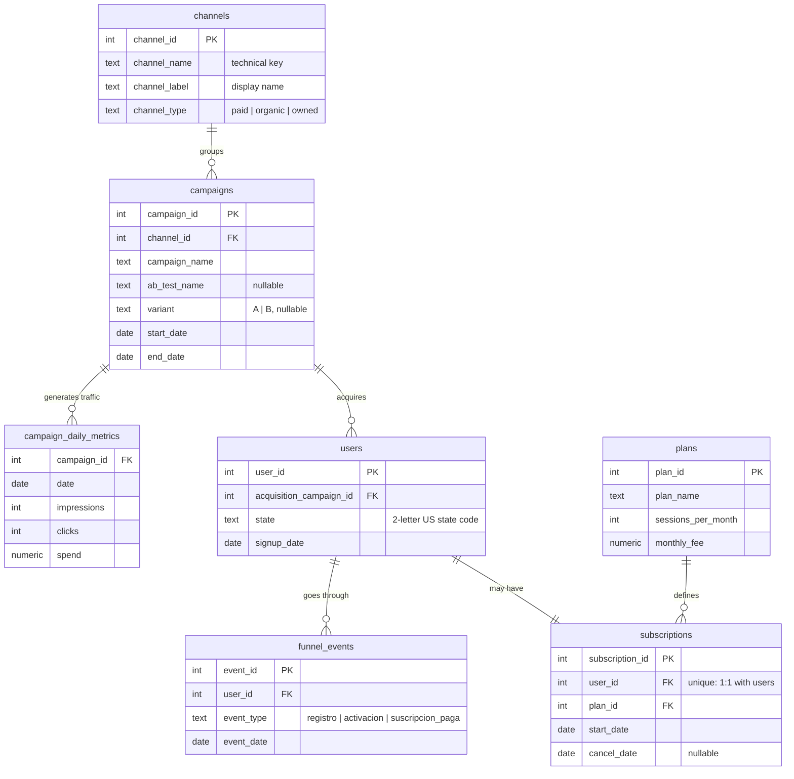

# Technical notes

Reference material for anyone who wants to reproduce or extend the project.
The [README](../README.md) covers the business side.

## Pipeline

```bash
pip install -r python/requirements.txt
python python/generate_data.py        # rebuilds data/teleterapia.db from scratch (fixed seed)
python python/analysis.py             # computes the mart tables
python python/export_for_powerbi.py   # dumps them to data/powerbi/*.csv
pytest python/tests                   # pipeline invariants
```

`generate_data.py` applies `sql/schema.sql` and simulates traffic, signups,
funnel events and subscriptions from the business parameters in
`config.py`. `analysis.py` estimates the metrics from the generated data (it
never reads the "true" generating rates) and writes them as mart tables in
the same SQLite file. `export_for_powerbi.py` exports those tables plus the
`channels` dimension to CSV so the Power BI model needs no SQLite driver. The
tests check rates stay within 0–1, totals agree across mart tables, allocated
spend equals total spend and the A/B test has exactly two variants.

`sql/metrics_queries.sql` holds reference queries (monthly cost per signup,
blended CAC, funnel conversion) written for a growth team.

## Data model



Mart tables written by `analysis.py`: `channel_metrics`,
`monthly_channel_metrics`, `funnel_conversion`, `state_metrics`,
`state_channel_metrics`, `ab_test_results`, `ab_test_summary`,
`ab_test_daily`.

## Sample results (seed 42)

**Metrics by channel** (`channel_metrics`)

| Channel | Spend | Signups | Paying customers | CAC | Monthly ARPU | Monthly churn | LTV | LTV:CAC |
|---|---|---|---|---|---|---|---|---|
| Email | $1,050 | 268 | 137 | $7.67 | $213.58 | 2.7% | $8,019.80 | 1045.6 |
| Organic | $0 | 386 | 134 | — | $215.97 | 3.3% | $6,469.71 | — |
| Google Ads | $78,291 | 1,235 | 414 | $189.11 | $211.55 | 4.3% | $4,965.25 | 26.3 |
| Meta | $38,573 | 982 | 132 | $292.22 | $215.98 | 7.3% | $2,962.08 | 10.1 |

Blended CAC across all channels: $144.

**Funnel by channel** (`funnel_conversion`)

| Channel | Signups | Activations | Paid | Signup → activation | Activation → paid | Signup → paid |
|---|---|---|---|---|---|---|
| Email | 268 | 228 | 137 | 85.1% | 60.1% | 51.1% |
| Organic | 386 | 277 | 134 | 71.8% | 48.4% | 34.7% |
| Google Ads | 1,235 | 892 | 414 | 72.2% | 46.4% | 33.5% |
| Meta | 982 | 498 | 132 | 50.7% | 26.5% | 13.4% |

**State × channel** (`state_channel_metrics`, excerpt)

| State | Channel | Signups | Paid | Signup → paid | Estimated CAC |
|---|---|---|---|---|---|
| TX | Google Ads | 211 | 98 | 46.4% | $136 |
| TX | Meta | 138 | 10 | 7.2% | $537 |
| FL | Meta | 105 | 8 | 7.6% | $516 |
| NY | Email | 26 | 22 | 84.6% | $5 |
| CA | Meta | 194 | 36 | 18.6% | $213 |

Spend by state is estimated: ad platforms report it per campaign, so each
campaign's spend is allocated to states in proportion to the signups it
produced there.

**A/B test** (`ab_test_results`, `ab_test_summary`)

| Variant | Clicks | Signups | Conversion rate | z | p-value | Significant (95%) |
|---|---|---|---|---|---|---|
| A (broad) | 1,243 | 40 | 3.22% | -1.726 | 0.0843 | No |
| B (lookalike) | 1,228 | 56 | 4.56% | -1.726 | 0.0843 | No |

Observed lift +41.7%; 95% CI of the difference −0.2 to +2.9 pp; 3,256
clicks per variant needed to confirm a lift of this size with 80% power
(2.6x the sample, ~80 more days at the test's daily budget).

## Design decisions

- **Fixed seed (`RANDOM_SEED = 42`)**: the whole pipeline is reproducible;
  running `generate_data.py` twice produces exactly the same database.
- **The business rates in `config.py` are never read by `analysis.py`**: the
  metrics are estimated from the generated data, the way a real analyst
  would.
- **The effects the analysis "discovers" are planted in the simulation**: the
  difference between A/B variants and the conversion multipliers by state and
  channel. Without them, any geographic difference would be noise, and a
  dashboard that finds patterns that do not exist is worse than one without
  that page.
- **Churn estimated with the person-period method**: every subscription
  contributes N 30-day periods at risk, plus 1 event if it ended in a
  cancellation (active subscriptions are censored, not counted as churn).
- **CAC computed with separate CTEs per grain** (`sql/metrics_queries.sql`,
  query 2): joining daily spend and paying customers in a single JOIN would
  fan out and inflate total spend; they are aggregated separately first.
- **15 US states instead of 50**: the most populous ones, so that per-state
  samples stay large enough to be informative.
- **Dashboard as code**: the report is stored as a `.pbip` project (PBIR JSON
  + TMDL), so every page, visual and relationship is versioned and reviewable
  in a diff. Business names live in the semantic layer (renamed columns and
  DAX measures such as `Blended CAC`), never in the source data.
- **Blended CAC is a measure, not an average of ratios**: total spend divided
  by total paying customers, so it stays correct under any channel filter.
- **Required sample size** uses the classic two-proportion formula with
  α = 0.05 (two-sided) and power 0.80.

## Opening the Power BI project

`powerbi/growth_analytics_dashboard.pbip` is a Power BI **project**, not a
`.pbix`. Power BI Desktop needs the preview feature *Power BI Project (.pbip)
save option* enabled (File → Options → Preview features), then File → Open
the `.pbip`. The Power Query sources point to the absolute path of
`data/powerbi/` on the machine where the project was saved; after cloning,
repoint them once in Transform data → Data source settings.
`powerbi/theme.json` is the report theme (Light-it-inspired dark palette,
validated for colour-vision deficiency).

## Repository layout

```
sql/
  schema.sql              transactional schema (dimensions + facts)
  metrics_queries.sql     reference queries for the growth team
python/
  config.py               business parameters (channels, rates, prices, A/B test, state effects)
  generate_data.py        generates the full simulation into SQLite
  analysis.py             computes the mart tables
  export_for_powerbi.py   exports the mart tables to CSV for Power BI
  tests/                  pipeline invariants (pytest)
data/
  teleterapia.db          generated database (not versioned, rebuilt by the scripts)
  powerbi/                CSV mart tables, the dashboard's source
docs/
  screenshots/            one capture per dashboard page
  technical-notes.md      this file
powerbi/
  growth_analytics_dashboard.pbip           Power BI project (open this)
  growth_analytics_dashboard.Report/        pages and visuals as JSON (PBIR)
  growth_analytics_dashboard.SemanticModel/ tables, relationships, measures (TMDL)
  theme.json                                report theme
```

Comments and identifiers in the Python/SQL code are in Spanish; everything
user-facing is in English.
